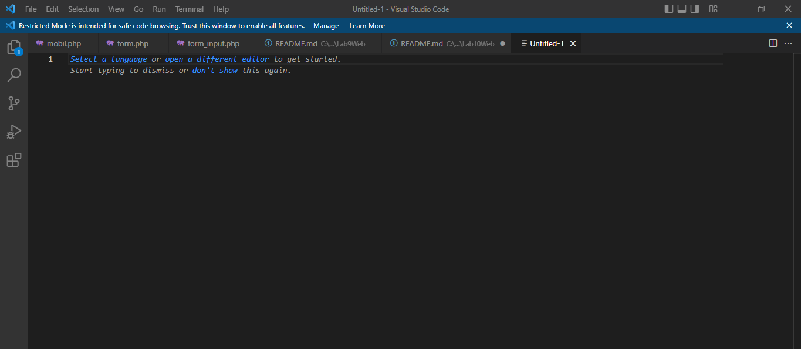
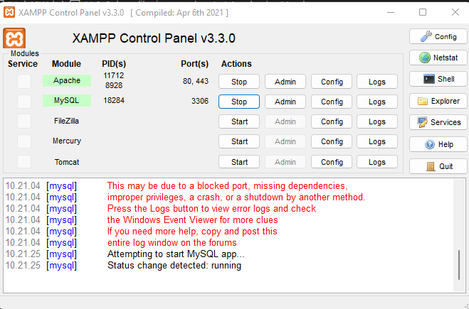
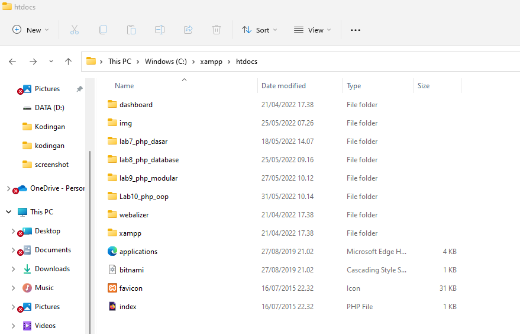
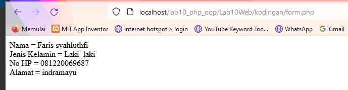
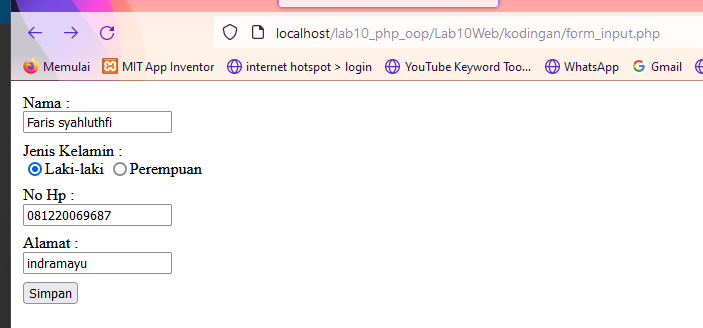

# Lab10Web


| Nama      | Faris Syahluthfi |
| ----------- | ----------- |
| NIM     | 312010034       |
| Kelas   | TI.20.A.1        |

## Langkah-langkah Praktikum 
## 1. Persiapkan text editor misalnya VSCode.

## 2. Buka aplikasi xampp dan start Apache dan Mysql

## 3. Buat folder baru dengan nama lab10_php_oop pada docroot webserver (htdocs)

## 4. Buat file baru dengan nama mobil.php

```php

<?php
/**
* Program sederhana pendefinisian class dan pemanggilan class.
**/
class Mobil
{
private $warna;
private $merk;
private $harga;
public function __construct()
{
$this->warna = "Biru";
$this->merk = "BMW";
$this->harga = "10000000";
}
public function gantiWarna ($warnaBaru)
{
$this->warna = $warnaBaru;
}
public function tampilWarna ()
{
echo "Warna mobilnya : " . $this->warna;
}
}
// membuat objek mobil
$a = new Mobil();
$b = new Mobil();
// memanggil objek
echo "<b>Mobil pertama</b><br>";
$a->tampilWarna();

echo "<br>Mobil pertama ganti warna<br>";
$a->gantiWarna("Merah");
$a->tampilWarna();
// memanggil objek
echo "<br><b>Mobil kedua</b><br>";
$b->gantiWarna("Hijau");
$b->tampilWarna();
?>

```

# Outputnya:


## 5. Buat file baru dengan nama form.php

```php

<?php 
    //proses yang dapat terjadi
    //mengambil data dari parameter input halaman  biodata
    $nama = $_POST['nama'];
    $jenis_kelamin = $_POST['jenis_kelamin'];
    $no_hp = $_POST['no_hp'];
    $alamat= $_POST['alamat'];
    //menampilkan data 
    echo "Nama = $nama"."<br>";
    echo "Jenis Kelamin = $jenis_kelamin" . "<br>";
    echo "No HP = $no_hp" . "<br>";
    echo "Alamat = $alamat";
    //disini ditulis proses lain yang dapat dilakukan seperti
    
    //insert ke database
    //update delete data
?>

```

# Outputnya:


## 6. Buat file baru dengan nama form_input.php

```php

<html>
<head>
    <title>Membuat Form Input Biodata PHP</title>
    <style>
        div {padding: 4px};
    </style>
</head>
<body>
        <form action="form.php" method="POST">
            <div>
                <label>Nama :</label> <br>
                <input name="nama" type="text">
            </div>
            <div>
                <label>Jenis Kelamin :</label> <br>                
                <input name="jenis_kelamin" value="Laki_laki" type="radio">Laki-laki
                <input name="jenis_kelamin" value="Perempuan" type="radio">Perempuan
            </div>
            <div>
                <label>No Hp :</label> <br>
                <input name="no_hp" type="text">
            </div>
            <div>
                <label>Alamat :</label> <br>
                <input name="alamat" type="text">
            </div>
            <div>
                <input type="submit" value="Simpan">
            </div>
        </form>
</body>
</html>

```

# Outputnya:

